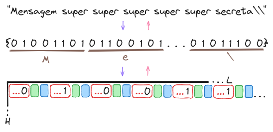
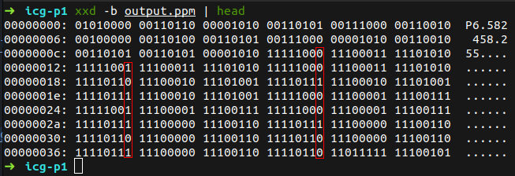

# Esteganografia

Este projeto visa implementar uma técnica de esteganografia em imagens PPM (Portable Pixmap). Foi desenvolvido como parte do curso no Departamento de Matemática da Universidade Federal de Sergipe, sob a supervisão do Prof. Evilson Vieira.
<br><br/>
A esteganografia consiste em ocultar informações dentro de dados aparentemente normais, tornando a presença da informação oculta imperceptível.

## Ocultar Mensagem

### Compilar e Executar

```bash
gcc ocultar.c -o ocultar -lm
./ocultar input.ppm
```

**Descrição:**
1. O programa lê uma imagem PPM do arquivo de entrada (`input.ppm`).
2. Converte a mensagem de texto em array de bits.
3. Oculta o array de bits nos bits menos significativos (LSBs) de cada componente vermelho (R) na imagem.
4. Salva a imagem modificada no arquivo de saída (`output.ppm`).

## Revelar Mensagem

### Compilar e Executar

```bash
gcc revelar.c -o revelar -lm
./revelar output.ppm
```

**Descrição:**
1. O programa lê a imagem PPM modificada do arquivo de saída (`output.ppm`).
2. Recupera os bits menos significativos (LSBs) dos componentes vermelho (R) e converte-os em um array de bits.
3. Converte os bits recuperados de volta para texto.
4. Imprime a mensagem original.

## Lógica Geral

<div>
    
</div>

## Resultados no console

### Observando o arquivo output.ppm com xxd

<div>
    
</div>


### Executando os programas

<div>
    
</div>

## Autor

- Mateus Figueiredo Pereira