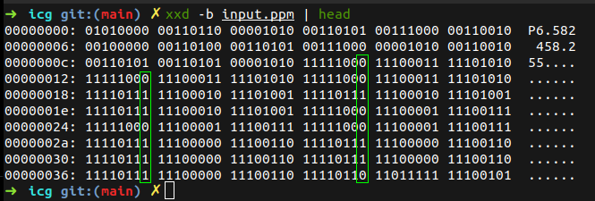

# Esteganografia

Este projeto visa implementar uma técnica de esteganografia em imagens PPM (Portable Pixmap). Foi desenvolvido como parte do curso no Departamento de Matemática da Universidade Federal de Sergipe, sob a supervisão do Prof. Evilson Vieira.
<br><br/>
A esteganografia consiste em ocultar informações dentro de dados aparentemente normais, tornando a presença da informação oculta imperceptível.
<br><br/>
A tecnica utilizada neste projeto consiste em ocultar a mensagem dentro dos bits menos significativos de cada componente (R) da imagem. Os bits menos significativos são aqueles que menos interferem no valor do componente, portanto, a alteração desses bits não é perceptível ao olho humano.
## Ocultar Mensagem

### Compilar e Executar

```bash
gcc ocultar.c -o ocultar
./ocultar input.ppm
```
- O programa lê uma imagem PPM `input.ppm`.
- Converte a mensagem em bits e os insere nos bits menos significativos da componente de cor vermelha (R) da imagem.
- Gera uma nova imagem com a mensagem oculta chamada `output.ppm`.

## Revelar Mensagem

### Compilar e Executar

```bash
gcc revelar.c -o revelar
./revelar output.ppm
```
- O programa lê a imagem gerada pelo `ocultar`.
- Extrai os bits menos significativos da componente de cor vermelha (R) para revelar a mensagem.
- O fim da mensagem é identificado pelo padrão binário `01011100`.
- Imprime a mensagem revelada no console.

## Lógica Geral

<div>
    
</div>

## Resultados no console

### 1. Observando o arquivo `input.ppm` com xxd

<div>
    
</div>

### 2. Executando os programas

<div>
    
</div>

### 3. Observando o arquivo `output.ppm`` com xxd

<div>
    
</div>

## Autor

- Mateus Figueiredo Pereira

## Observações

- A mensagem de exemplo no programa `ocultar.c` pode ser modificada, mas é importante manter o comprimento máximo do programa `revelar.c`.